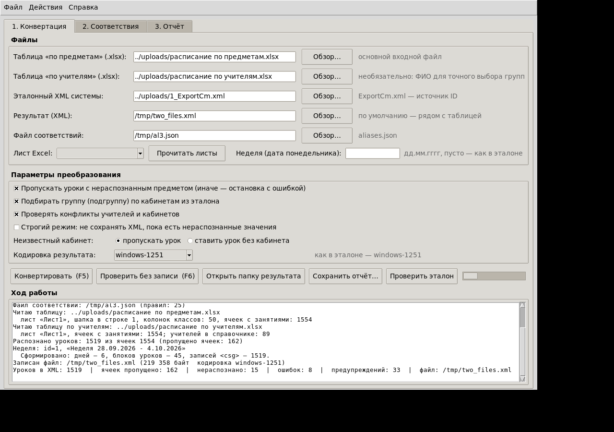
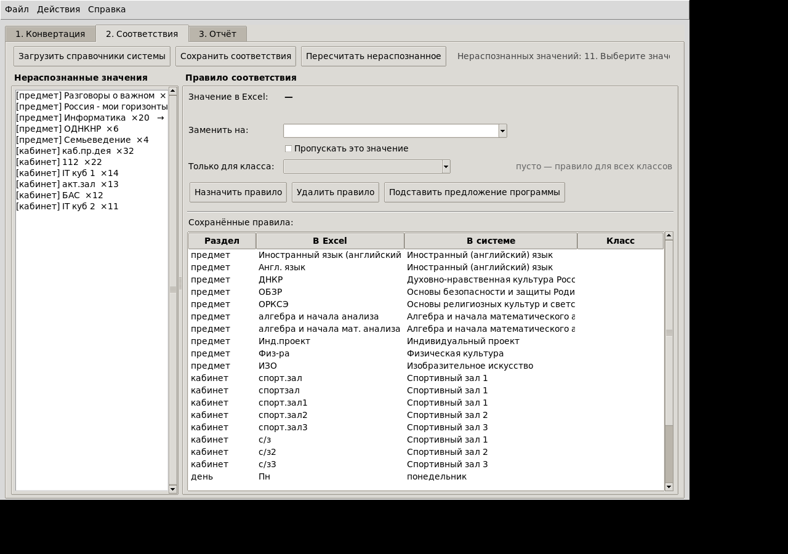
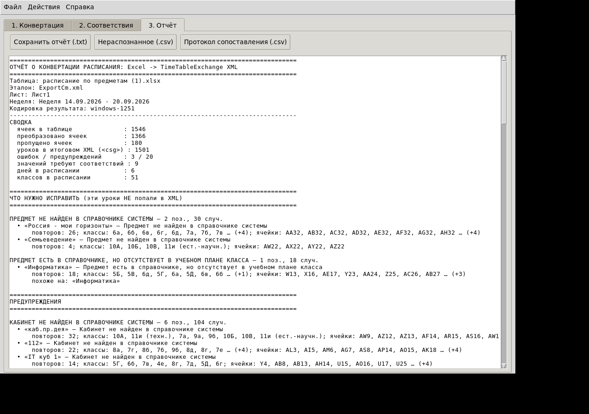

# Конвертер расписания: Excel → XML (TimeTableExchange)

Утилита приводит таблицы расписания (Excel) к формату обменного файла системы
(`ExportCm.xml`, схема `TimeTableWeek.xsd`) — тому, который система принимает на импорт.
На вход принимаются **две таблицы**: обязательная «по предметам» и дополнительная
«по учителям» — она даёт ФИО преподавателей, по которым точнее выбирается строка плана
(группа/подгруппа) и ловятся расхождения «сетка школы vs план системы».

* **Разбор обоих форматов:** [`STRUCTURE.md`](STRUCTURE.md)
* **Окно программы:** `gui.py` (вкладки «Конвертация», «Соответствия», «Отчёт»)
* **Консольный режим:** `python -m converter.cli …`
* Вся логика — в пакете `converter/`, окно и CLI лишь оболочки над одной функцией `core.convert()`.

---

## Что делает конвертер

1. Читает **эталонную выгрузку системы** (`ExportCm.xml`) как справочник идентификаторов:
   звонки (`LessonTime`), учителя (`tid`), предметы (`sid`), кабинеты (`room id`),
   классы и учебный план (`csg id`).
2. Читает **таблицу «по предметам»**: `Дни | Уроки | классы…`, ячейка — `Предмет (кабинет)`,
   деление на группы — `Предмет (каб1,каб2)` или `Предмет1, Предмет2 (каб1,каб2)`.
3. Читает **таблицу «по учителям»** (если указана): та же сетка, но в ячейках
   `Фамилия И.О. (кабинет)`. ФИО сопоставляются со справочником учителей (фамилия точно,
   отчество по префиксу — «Вл.» отличает Владимировну от Васильевны; опечатки вида «Е..С.»
   терпимы). Учитель из таблицы сужает выбор строки плана до его собственной;
   если учитель не ведёт эту строку плана — предупреждение в отчёте.
4. Сопоставляет названия со справочниками; если предмет есть в справочнике, но отсутствует
   в плане класса (типично: «Информатика» в 5–6 классах при «Программирование и алгоритмика»
   в плане), применяется **автоподбор по остатку плана**: единственный непокрытый предмет
   плана класса связывается с единственным «лишним» предметом таблицы, но только если учитель
   из таблицы «по учителям» ведёт этот остаточный предмет (иначе — только подсказка человеку) (точное совпадение → аббревиатура →
   перестановка слов → нечёткое сравнение → правила из `aliases.json`),
   подбирает группу/подгруппу, проверяет конфликты учителей и кабинетов, сверяет часы с планом.
5. Собирает новый XML: секции-словари копируются из эталона **байт в байт**,
   пересоздаётся только блок `<TimeTable>`. Кодировка результата — как у эталона (windows-1251).
6. Всё нераспознанное **не молча теряется, а попадает в отчёт** и во вкладку «Соответствия»,
   где чинится одним кликом (правило сохраняется в `aliases.json` и работает дальше автоматически).

---

## Установка

Нужен Python 3.9+ и библиотека `openpyxl`:

```
pip install openpyxl
```

Дальше — либо окно, либо консоль.

### Окно (GUI)

```
python gui.py            # или двойной клик по «Запуск GUI.bat» в Windows
```



Порядок работы:

1. Укажите файл таблицы «по предметам» (`.xlsx`), желательно таблицу «по учителям»,
   эталонный XML системы и куда сохранить результат.
2. **«Проверить эталон»** — целостность самой выгрузки системы: дубликаты id, висячие
   ссылки (`csg`→предмет/учитель/кабинет, `timeId`→звонки), учитель и кабинет в двух местах
   одновременно, расхождение часов с планом. То же в консоли: `--check-reference`.
3. **F6 «Проверить без записи»** — посмотреть, что распознаётся, ничего не записывая.
4. Если во вкладке «Соответствия» есть нераспознанные значения — выберите значение слева,
   укажите справа название из справочника (или отметку «пропускать»), нажмите «Назначить правило».
   Правило для одного класса задаётся полем «Только для класса».
5. **F5 «Конвертировать»** — запись XML. Отчёт и протокол сопоставления — во вкладке «Отчёт».





### Консоль (CLI)

```
python -m converter.cli "расписание.xlsx" --reference ExportCm.xml -o ExportCm_new.xml ^
    --report отчёт.txt --unresolved нераспознанное.csv --mapping протокол.csv
```

Основные ключи:

| ключ | смысл |
|---|---|
| `-r, --reference` | эталонный XML системы (обязательно) |
| `-t, --teachers` | таблица «расписание по учителям» (необязательно, уточняет группы и учителей) |
| `-o, --output` | файл результата; по умолчанию — рядом с таблицей |
| `-a, --aliases` | файл соответствий; по умолчанию `aliases.json` рядом с эталоном |
| `--week дд.мм.гггг` | задать понедельник недели (иначе имя недели берётся из эталона) |
| `--room-mode skip\|noroom` | неизвестный кабинет: пропустить урок / поставить урок без кабинета |
| `--no-align` | не подбирать подгруппу по истории кабинетов из эталона |
| `--no-conflicts` | не проверять занятость учителей и кабинетов |
| `--strict` | не писать XML, пока есть нераспознанные значения |
| `--dry-run` | только проверка, без записи файла |
| `--check-reference` | проверить целостность эталонного XML и выйти |
| `--encoding utf-8` | другая кодировка результата |
| `--init-aliases` | создать пустой файл соответствий |

---

## Файл соответствий `aliases.json`

Создаётся автоматически при первом запуске, правится вручную или из вкладки «Соответствия»:

```json
{
  "subjects": { "Иностранный язык (английский)": "Иностранный (английский) язык",
                "Разговоры о важном": null },
  "rooms":    { "спорт.зал": "Спортивный зал 1", "спорт.зал2": "Спортивный зал 2" },
  "classes":  { "11и": { "candidates": ["11и (ест.-научн.)", "11и (техн.)"],
                          "by_subject": { "химия": "11и (ест.-научн.)" } } },
  "days":     { "Пн": "понедельник" },
  "class_subjects": { "5А": { "Информатика": "Программирование и алгоритмика" } }
}
```

* ключ — значение из Excel (регистр и лишние знаки не важны);
* значение — точное название из справочника системы; `null` — осознанно пропускать;
* `class_subjects` — когда одно и то же слово в таблице означает разное в разных классах;
* `teachers` — когда ФИО из таблицы не узнаётся («Киселев А.Ю.» → полное ФИО или `null`).

---

## Проверки и отчёт

Отчёт содержит: сводку по ячейкам и урокам; список нераспознанного с классами и ячейками;
предупреждения (кабинеты-фантомы, конфликты «учитель в двух местах», «кабинет занят дважды»,
«учитель таблицы не ведёт строку плана», расхождения кабинетов/групп между двумя таблицами);
сверку фактических часов с `hrsweek` плана; состав расписания по дням и классам.
Дополнительно сохраняются CSV: список нераспознанного и **протокол сопоставления**
(«что во что превратилось» — удобно проверить глазами перед импортом).

Пример результата на ваших файлах — в папке [`example/`](example): результат конвертации
недели 28.09–4.10.2026 (эталон `1_ExportCm.xml`), отчёт, CSV нераспознанного, протокол
сопоставления и вывод проверки эталона (`проверка_эталона.txt`).

---

## Структура проекта

```
timetable-tool/
├── gui.py                  окно программы (tkinter)
├── converter/
│   ├── reference.py        разбор эталонного XML, индексы id
│   ├── excel_reader.py     разбор таблицы (шапка, дни, номера, ячейки «предмет (кабинет)»)
│   ├── text_utils.py       нормализация и нечёткое сопоставление названий
│   ├── aliases.py          файл соответствий aliases.json
│   ├── teachers.py         распознавание ФИО из таблицы по учителям (инициалы, тёзки)
│   ├── matching.py         выбор классов/предметов/групп/кабинетов/учителей, проверки, протокол
│   ├── builder.py          генерация блока <TimeTable>, кодирование результата
│   ├── report.py           отчёт, CSV нераспознанного и протокола
│   ├── validate.py         проверка целостности эталона (дубли, висячие ссылки, конфликты)
│   ├── core.py             Options/ConvertResult и связка convert()
│   └── cli.py              командная строка
├── aliases.json            стартовые соответствия (правятся под вашу школу)
├── tests/test_core.py      тесты: python tests/test_core.py
├── example/                результат конвертации ваших файлов + отчёты
├── docs/                   снимки окна программы
├── Запуск GUI.bat          запуск окна в Windows
├── build_exe.bat           сборка однофайлового .exe (PyInstaller)
└── STRUCTURE.md            подробный разбор форматов XML и Excel
```

## Тесты

```
python tests/test_core.py
```

Проверяются: разбор ячеек и дней, загрузка эталона, соответствия, генерация XML
(id из плана, отсутствие дублей в уроке, байт-в-байт словари, кодировка/LF),
режимы `noroom`, порядок дней/уроков. На ваших файлах прогон даёт ~1500 уроков,
99,5 % совпадений с эталоном по сравнимым слотам.

## Сборка .exe (Windows)

```
build_exe.bat
```

Внутри: `pip install pyinstaller openpyxl`, затем
`pyinstaller --onefile --windowed --name "Конвертер расписания" gui.py`.
Готовый файл — `dist\Конвертер расписания.exe`; `aliases.json` и `settings.json`
создаются рядом с exe.

## Если правила соответствий «не работают»

Признак: правило во вкладке «Соответствия» есть, а значение слева всё ещё в списке
нераспознанных. Причины и поведение программы:

1. **Цели правила нет в справочнике эталона.** Правило «каб.пр.дея → ЦПД» сработает только
   если кабинет с названием «ЦПД» существует в выгрузке системы: XML содержит id, и ид
   брать неоткуда. Программа теперь:
   * помечает такое правило в списке сохранённых меткой «⚠ нет в эталоне»;
   * пишет в отчёт отдельным пунктом: «Правило соответствия … не сработало: кабинета
     „ЦПД“ нет в справочнике эталона…»;
   * при назначении правила из окна показывает предупреждение сразу.
   Лечение: добавить кабинет/предмет/учителя **в системе**, выгрузить новый эталонный XML
   и указать его программе — после этого правило заработает без изменений. Или исправить название
   в правиле на то, что реально есть в справочнике (выпадает списком).
2. **Правило правили вручную в `aliases.json` при открытом окне.** Программа перечитывает
   файл перед каждым запуском конвертации, если он изменился на диске, и больше не
   затирает его сохранением из памяти.
3. Цель написана с опечаткой или другими пробелами/регистром — не важно: сравнение
   нормализованное. А вот другое название («спортзал» и «Спортивный зал 1») — важно:
   берите строку из выпадающего списка.
4. Правило «Вс → воскресенье» помечается «⚠ нет в эталоне», если в выгрузке шестидневка
   без воскресенья — это безопасно, правило просто не используется.

## Типовые ситуации (как решаются)

| Ситуация в таблице | Решение |
|---|---|
| «Разговоры о важном», «Россия — мои горизонты» и т.п. не нужны в системе | правило `null` (пропускать) — уроки не попадут в XML, отчёт покажет количество |
| предмет нужно добавить в систему | сначала создать предмет/план в системе и выгрузить новый эталон, затем конвертировать |
| «Информатика» у 5–6 классов = «Программирование и алгоритмика» в плане | `class_subjects` или правило «только для класса» в окне |
| колонка «11и» = два профильных класса | распределяется по часам плана; точные правила — `classes → by_subject` |
| «спорт.зал», «акт.зал», «БАС», «IT куб», «112» | спортивные залы уже прописаны в `aliases.json`; остальные — правило во вкладке «Соответствия» либо новый кабинет в системе |
| «Химия_» с хвостом | хвост игнорируется; если нужна конкретная подгруппа — правило для класса |
| две Ольги Кузнецовы («О.В.») | «О.Вл.» указывает Владимировну; «О.В.» программа уточняет по плану класса |
| учитель таблицы не совпадает с планом | предупреждение в отчёте: правьте план в системе или таблицу |
| учителя нет в справочнике («Киселев А.Ю.») | завести в системе или добавить правило `teachers` |
